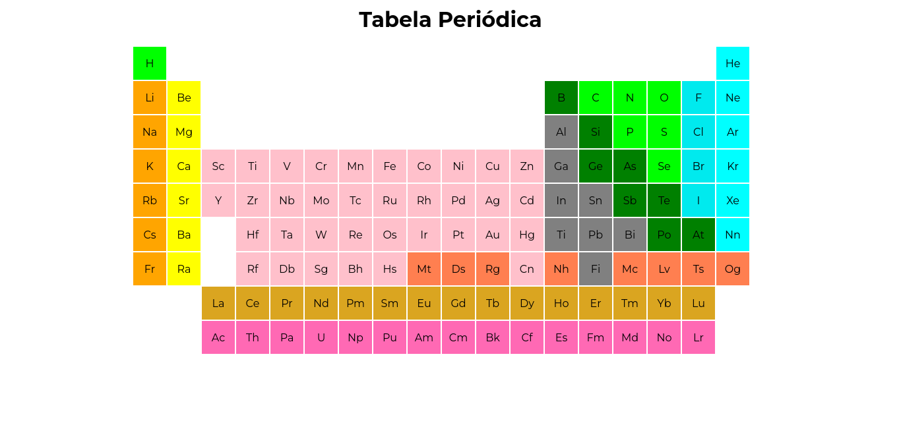

# Tabela Periodica Descodificadas
A tarefa da Semana é fazer a Tabela Periódica com HTML e CSS

 ## Descrição 

Esse código HTML cria uma tabela periódica dos elementos químicos. A tabela é criada dentro de uma tag `<table>` e consiste em várias linhas e colunas de células, onde cada célula representa um elemento químico.

A primeira linha da tabela é um cabeçalho com o título "Tabela Periódica". As outras linhas representam os períodos e grupos da tabela.

As células são definidas como `<td>` e possuem a propriedade bgcolor para definir a cor de fundo de cada célula, de acordo com o elemento químico que representa. Alguns elementos ocupam mais de uma célula, por isso a propriedade colspan é utilizada para mesclar várias células em uma só.

As linhas que representam os lantanídeos e actinídeos são separadas das outras linhas e têm um fundo de cor diferente. Essas linhas também têm células mescladas para representar os elementos químicos que estão dentro dessas séries.

O código também inclui um link para um arquivo CSS externo, que deve conter as regras de estilo para a tabela. Nesse caso, não há nenhuma regra CSS dentro do próprio HTML.

 
Criado Por Mayara Rocha &#10084;

